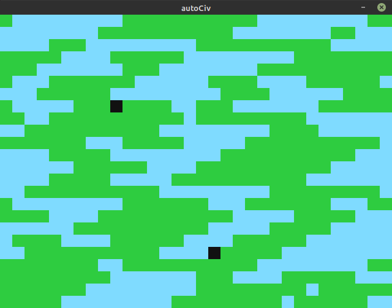
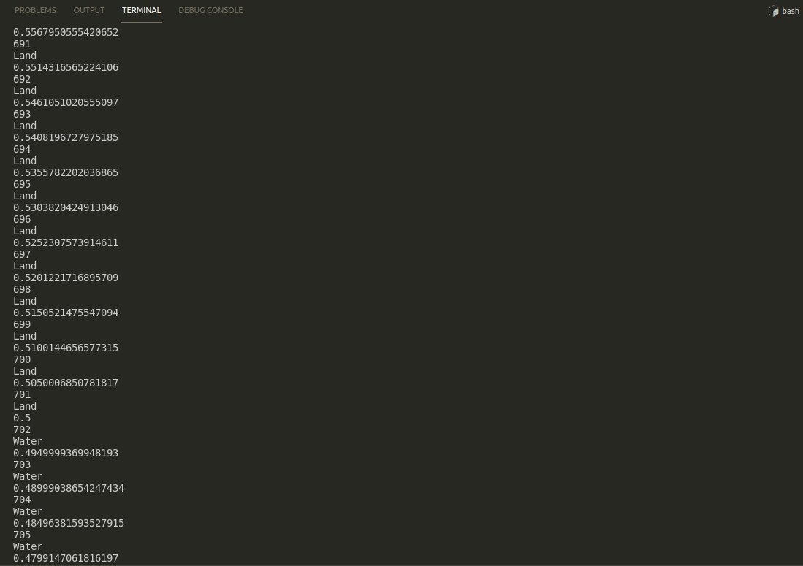
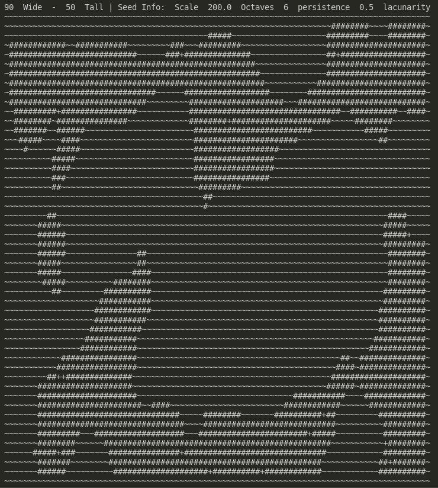

# Auto-Civ

This ruby program is meant to be a small widget like recreation of the popular game series civilization. I chose ruby because I wanted to have some experience writing in the language and using their package manager gems. This projects purpose is to give me a distraction while working on other projects. I would like to adapt this to other programming languages like a lisp dialect or haskell.

## Inner workings

### LandGen.rb
This ruby file is the project. Contained is a Logic class and the rest of the program. The Logic class is responsible for determining whether a generated tile is blue ("Water") or green ("Land"), where a faction will spawn which is designated by a black tile, and other auxilary functions. The game loop uses the perlin noise library to generate a two dimensional array of decimals that allow for the determination of whether the index is a "Land" or a "Water". A nested while loop cycles through the strings generating the new Square objects from ruby's 2d game library. The factions are then generated through random integers in the range of the the width and height of the game window.

### Test.rb
This ruby file is meant to give printed output on the perlin noise land generation technique I used. *It is in **no way required** for the execution of **LandGen.rb***

An arbitrary threshold is set to determine whether the tile generated will be a "Land" or "Water" tile. The threshold of "0.5" could also be randomly generated to add even more variety to the generation.

### Python CLI Version
worldSim.py is a remake of LandGen.rb but uses the terminal environment as the display.

## Screenshots 




## Install Dependencies

Ruby
```
sudo apt install libsdl2-dev libsdl2-image-dev libsdl2-mixer-dev libsdl2-ttf-dev
sudo apt install ruby
sudo apt install ruby-dev
sudo gem install ruby2d
sudo gem install perlin_noise
```
Python
```
sudo pip3 install noise

```

## Projects Future
- Clean up the code by creating a window creation class and a game loop class. 
- Replace placeholder color for faction tile generation with colors in the factions array.
- Add more objects and behaviors!
  - Generated Territory, Players, rudimentary AI, etc 
- And more the sky is the limit!

## Contact Me!
Author: Ethan Moore  
Email: eldm2350@protonmail.com  
Github: https://github.com/eldm-ethanmoore  
LinkedIn: https://www.linkedin.com/in/ethan-moore-a7106121a/  
